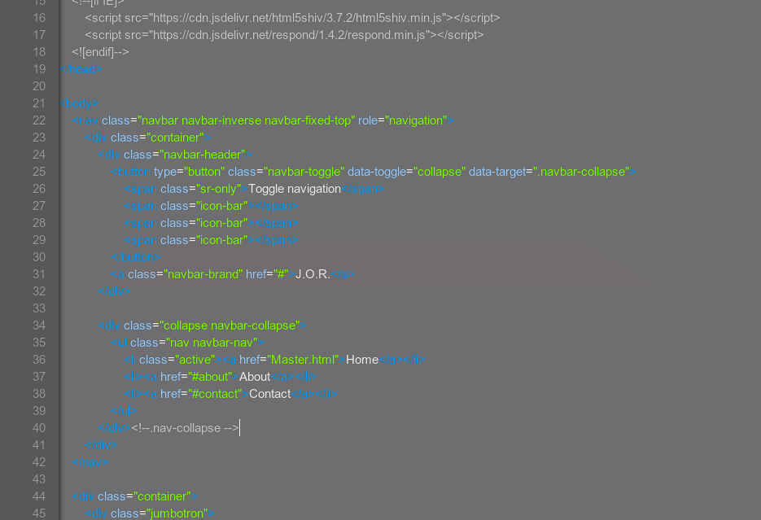
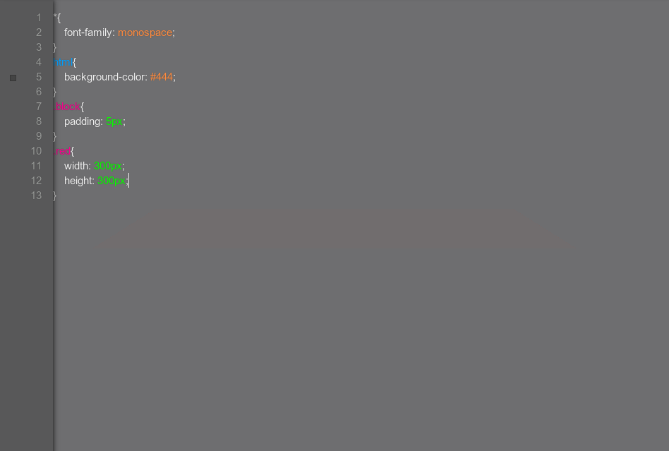
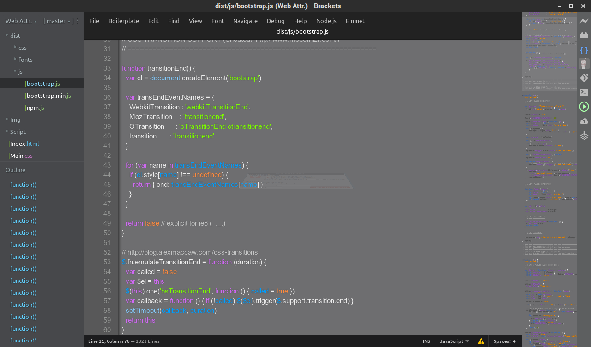

# Graphite in Neon
A semi-dark theme for Brackets. It's grey background gives you the brightness of a light theme and the effect of a dark theme. This theme is perfect for hours and hours of coding without putting a strain on your eyes.

Bright syntax  colours help make your code reable.

It's an elegent theme that is always improving and will look great with any coding language

